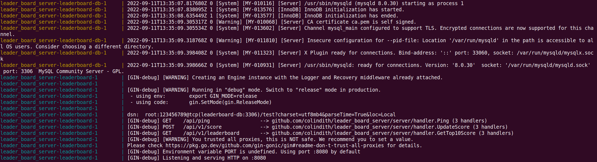
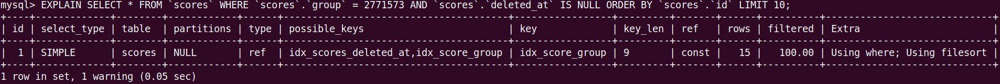

# leader_board_server

## Quick Start

To start the server, please run with the docker compose. It will start the Gin backend server, Redis server, and a MySQL database.

```bash
> docker compose up
```


Once the Gin server completes the starting process, it is ready to receive requests.
```bash
> curl -X POST http://localhost:8080/api/v1/score -H "Content-Type:application/json" -H "ClientId:a" -d '{"score":115.55}'
< {"status":"ok"}

> curl -X GET http://localhost:8080/api/v1/leaderboard
< {
      "status":"ok",
      "topPlayers":[
          {
              "clientId":"b",
              "score":116.55
          },
          {
              "clientId":"a",
              "score":115.55
          },
          {
              "clientId":"p",
              "score":114.55
          },
          {
             "clientId":"o",
              "score":113.55
          },
          {
              "clientId":"n",
              "score":112.55
          },
          {
              "clientId":"m",
              "score":111.55
          },
          {
              "clientId":"l",
              "score":110.55
          },
          {
              "clientId":"k",
              "score":109.55
          },
          {
              "clientId":"j",
              "score":108.55
          },
          {
              "clientId":"i",
              "score":107.55
          }
      ]
  }
```
The leaderboard will be reset every 10 minutes. The length of the `topPlayers` is equal to or less than 10.

## Design

### DB(MySQL) and Table Schema
According to the requirements, the database should be able to support querying the top N items. With Index, RDB can provide such functionality in a relatively fast fashion.
The schema of `Score` table is shown below:

|Field Name|Type|Description|
|----|----|----|
| id | big uint | primary key |
| client_id | varchar(32) |  |
| score | decimal(10,2) |  |
| group | bigint |  |
| timestamp | bigint |  |

The `client_id` is in string format and we limit its length to be within 32. The score will be rounded down to 2 decimal places.
The `group` is an integer that defines the "round" of the leaderboard. Each round will only last for 10 minutes.
Once it ended, the value of the `group` will be added by one so that it will be different from the previous round.

The `client_id` and `group` fields are unique together.
That means in each group, each client would only have the highest score record.
Every time we have a new record for a certain existing client, the server overwrites the score on the same row of data.
And we employ lock while updating to prevent the race condition.

The `timestamp` field is simply the time that the record is written.

We apply composite index on `group` and `score` to enable fast query of the top 10 scores under a certain group.

From the screen can see that the ordering query would use the composite index of `group` and `score`.

### Gin
The Gin is chosen as the backend framework because it is lightweight and fast.

### Redis and Cache
The leaderboard is cached in Redis as a single key.
We do so to speed up the process of incoming requests and also lower the loading of the database.

Once there is a new record added by the client, the backend server will check if the record would cause any change to the current leaderboard.
If it is, the server will delete the leaderboard cache and fetch it from the database again.
So that the leaderboard cache would never be outdated.

### Gorm
A well-documented database framework that can fulfill our requirements.

### Regigo
A Redis client library that provide flexible communication between Gin server and Redis.
